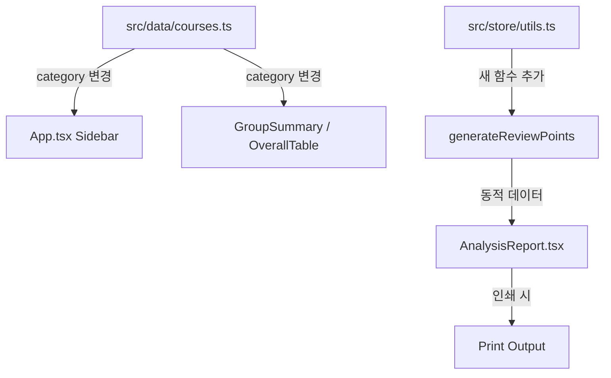

# Design Document: print-report-update

## Overview

이 기능은 두 가지 변경을 수행한다:

1. **미지정과정 확정 처리**: 과정 11, 12, 13의 category를 "미지정"에서 "공모과정"으로 변경하고, 관련 특수 스타일링(italic, opacity-60)을 제거한다.
2. **중점 검토 포인트 동적 생성**: AnalysisReport의 하드코딩된 3개 검토 포인트를 현재 예산 데이터 기반으로 동적 생성하는 함수로 교체한다.

## Architecture

변경 범위가 작으므로 기존 아키텍처를 유지한다.



변경 파일:
- `src/data/courses.ts` — category 값 변경
- `src/App.tsx` — "미지정" 관련 코드 정리 (CATEGORY_COLOR, CATEGORY_DOT에서 "미지정" 제거 가능, isUnset 로직 제거)
- `src/store/utils.ts` — `generateReviewPoints()` 함수 추가
- `src/components/report/AnalysisReport.tsx` — 하드코딩 `<ul>` 을 동적 호출로 교체

## Components and Interfaces

### 1. 데이터 변경 (courses.ts)

과정 11, 12, 13의 `category`를 `"공모과정"`으로 변경한다.

```typescript
// Before
const course11: Course = { ..., category: "미지정", ... };

// After
const course11: Course = { ..., category: "공모과정", ... };
```

### 2. App.tsx 사이드바 정리

```typescript
// 제거할 코드:
const isUnset = course.category === "미지정";
// isUnset 조건부 클래스 적용 제거

// CATEGORY_COLOR, CATEGORY_DOT에 "공모과정" 항목 추가
"공모과정": "bg-pink-50 text-pink-700 ring-pink-200",  // CATEGORY_COLOR
"공모과정": "bg-pink-500",                              // CATEGORY_DOT
```

"미지정" 항목은 제거하거나 남겨둬도 무방하다 (사용되지 않으므로).

### 3. generateReviewPoints 함수 (utils.ts)

```typescript
export type ReviewPoint = {
  text: string;
};

export function generateReviewPoints(
  courses: Course[],
  totalBudget: number
): ReviewPoint[] {
  const points: ReviewPoint[] = [];

  // 1. 증액 과정 검토
  const increasedCourses = courses.filter(c => {
    const t = courseTotals(c);
    return t.adjusted > t.original;
  });
  if (increasedCourses.length > 0) {
    const topIncrease = increasedCourses
      .sort((a, b) => courseTotals(b).variance - courseTotals(a).variance)[0];
    points.push({
      text: `증액 과정 ${increasedCourses.length}개 — 최대 증액: ${topIncrease.name} (+${formatWon(courseTotals(topIncrease).variance)})`,
    });
  }

  // 2. 저집행 항목 검토
  const lowExecCourses = courses.filter(c => {
    const t = courseTotals(c);
    return t.executionRate < 0.3 && t.adjusted > 0;
  });
  if (lowExecCourses.length > 0) {
    points.push({
      text: `저집행 과정 ${lowExecCourses.length}개 (집행률 30% 미만) — 집행계획 점검 필요`,
    });
  }

  // 3. 미배분 잔액 검토
  const totalAllocated = courses.reduce((s, c) => s + courseTotals(c).adjusted, 0);
  const unallocated = totalBudget - totalAllocated;
  if (unallocated > 0) {
    points.push({
      text: `미배분 잔액 ${formatWon(unallocated)} — 추가 배분 또는 예비비 편성 검토`,
    });
  }

  // 4. 기준성 항목 증액 검토
  const standardItems = courses.flatMap(c =>
    c.items.filter(i => !i.isDeleted && i.name.includes("훈련지원금") && i.adjusted > i.original)
  );
  if (standardItems.length > 0) {
    points.push({
      text: `기준성 항목(훈련지원금 등) ${standardItems.length}건 증액 — 내부 기준 정합성 재확인`,
    });
  }

  // 최소 1개 포인트 보장
  if (points.length === 0) {
    points.push({ text: "현재 특이사항 없음 — 정상 집행 중" });
  }

  return points;
}
```

### 4. AnalysisReport.tsx 변경

하드코딩된 `<ul>` 블록을 `generateReviewPoints` 호출 결과로 교체:

```tsx
import { generateReviewPoints } from "../../store/utils";

// 컴포넌트 내부 (TOTAL_BUDGET은 prop으로 전달하거나 상수 import)
const reviewPoints = generateReviewPoints(courses, 278_500_000);

// JSX
<ul className="space-y-2 text-sm leading-6 text-amber-800">
  {reviewPoints.map((point, idx) => (
    <li key={idx} className="flex items-start gap-2">
      <span className="w-1 h-1 rounded-full bg-amber-400 mt-2.5 flex-shrink-0" />
      {point.text}
    </li>
  ))}
</ul>
```

## Data Models

### ReviewPoint (새 타입)

```typescript
export type ReviewPoint = {
  text: string;
};
```

기존 `Course`, `CourseTotals` 타입은 변경 없음.

## Correctness Properties

*A property is a characteristic or behavior that should hold true across all valid executions of a system — essentially, a formal statement about what the system should do. Properties serve as the bridge between human-readable specifications and machine-verifiable correctness guarantees.*

### Property 1: 증액 과정 존재 시 검토 포인트 포함

*For any* set of courses where at least one course has `adjusted > original`, the `generateReviewPoints` function SHALL return at least one review point whose text mentions the increased course count.

**Validates: Requirements 4.3**

### Property 2: 저집행 과정 존재 시 검토 포인트 포함

*For any* set of courses where at least one course has `executionRate < 0.3` and `adjusted > 0`, the `generateReviewPoints` function SHALL return at least one review point whose text mentions low execution.

**Validates: Requirements 4.4**

### Property 3: 미배분 잔액 존재 시 검토 포인트 포함

*For any* total budget and set of courses where `totalBudget - sum(adjusted) > 0`, the `generateReviewPoints` function SHALL return at least one review point whose text mentions the unallocated amount.

**Validates: Requirements 4.5**

## Error Handling

- `generateReviewPoints`가 빈 courses 배열을 받으면 기본 "특이사항 없음" 포인트를 반환한다.
- `totalBudget`이 0 이하인 경우에도 함수는 정상 동작하며, 미배분 잔액 포인트를 생성하지 않는다.
- 기존 `courseTotals` 함수의 0 나누기 방어 로직을 그대로 활용한다.

## Testing Strategy

### Unit Tests (Example-based)

- 과정 11, 12, 13의 category가 "공모과정"인지 확인
- App.tsx에서 `isUnset` 로직이 제거되었는지 확인 (코드 리뷰)
- CATEGORY_COLOR/CATEGORY_DOT에 "공모과정" 매핑이 존재하는지 확인
- `generateReviewPoints`에 빈 배열 전달 시 기본 포인트 반환 확인
- 인쇄 CSS에서 검토 포인트 영역이 숨겨지지 않는지 확인

### Property Tests

- **라이브러리**: fast-check (TypeScript PBT 라이브러리)
- **최소 100회 반복** per property
- Property 1~3을 `generateReviewPoints` 함수에 대해 테스트
- 랜덤 Course 배열과 totalBudget 값을 생성하여 조건부 출력 검증

**Tag format**: `Feature: print-report-update, Property {N}: {description}`
